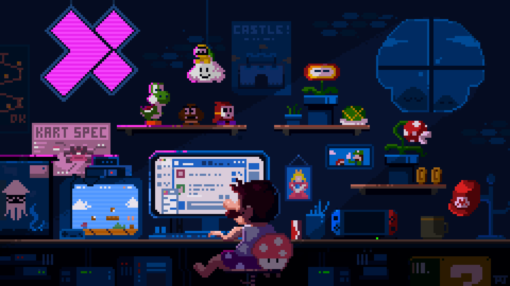

---

<link rel="stylesheet" href="https://cdnjs.cloudflare.com/ajax/libs/font-awesome/7.0.1/css/brands.min.css" integrity="sha512-WxpJXPm/Is1a/dzEdhdaoajpgizHQimaLGL/QqUIAjIihlQqlPQb1V9vkGs9+VzXD7rgI6O+UsSKl4u5K36Ydw==" crossorigin="anonymous" referrerpolicy="no-referrer" />

<h1>👋 Hi, I'm <strong>Naimur Rahman</strong></h1>
<h2>🤖 <strong>ML Engineer</strong> & <strong>Data Scientist</strong> | Fresh Graduate, BRAC University</h2>
<h4>🧠 Specializing in <strong>Machine Learning</strong>, <strong>Deep Learning</strong>, and <strong>Computer Vision</strong></h4>
<h4>🔬 Built an end-to-end medical image segmentation pipeline on the <strong>BraTS2024</strong> dataset for my undergraduate thesis</h4>
<h4>⚙️ I care about clean code, reproducible pipelines, and models that actually generalize</h4>
<h4>📂 Explore my repositories to see what I'm building</h4>
<h4>📫 Reach me at <strong>naimur.rahman3@g.bracu.ac.bd</strong></h4>

## 🌐 Socials:

## 🔬 Featured Work

**🧠 A Lightweight Multi-Modal Deep Learning Framework for Brain Tumor Segmentation & Classification Using MRI :**   
End-to-end deep learning pipeline on the **BraTS2024 GLI** dataset — 2.5D Attention U-Net for segmentation, custom ResNet-10 for classification, fused via a novel SMM-Fusion gating architecture. Evaluated across Dice, IoU, F1, and ROC-AUC on multilabel tumor subregions.

**🏠 Residential Flat Price Predictor** *(Regression)* **:**  
End-to-end regression pipeline predicting Dhaka flat prices using XGBoost, LightGBM, and Random Forest, with feature engineering via PCA and ANOVA F-test.

**📊 Flat Price Justification Model** *(Classification)* **:**  
Binary classification system determining whether a listed flat price is justified relative to market data — built on engineered features from the regression project.

📂 Explore the full repos below.

# 💻 Tech Stack

<!--  -->

# 📊 GitHub Stats:

## 🏆 GitHub Trophies

### ✍️ Random Dev Quote

<!-- 

### 🔝 Top Contributed Repo

 -->

## 💰 You can help me by Donating

